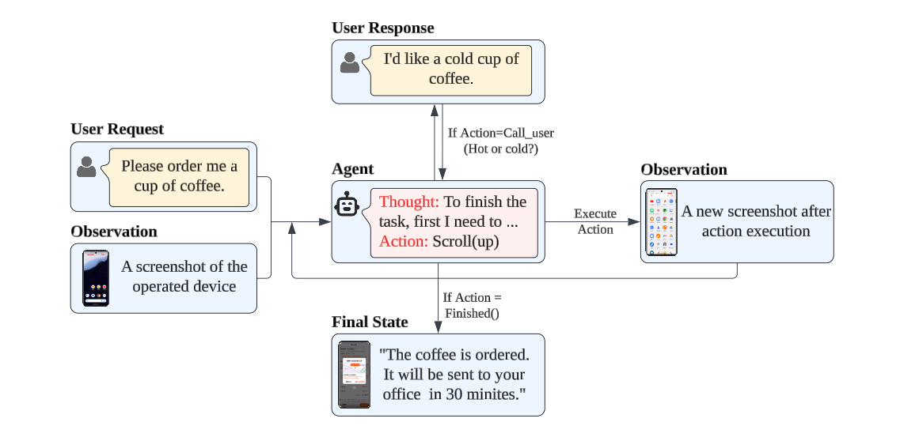
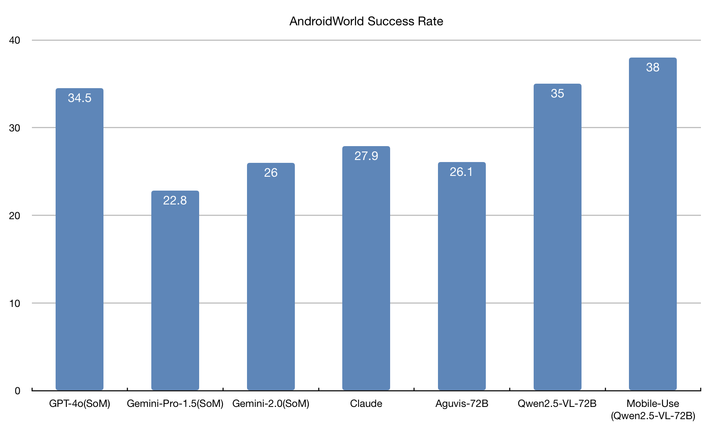
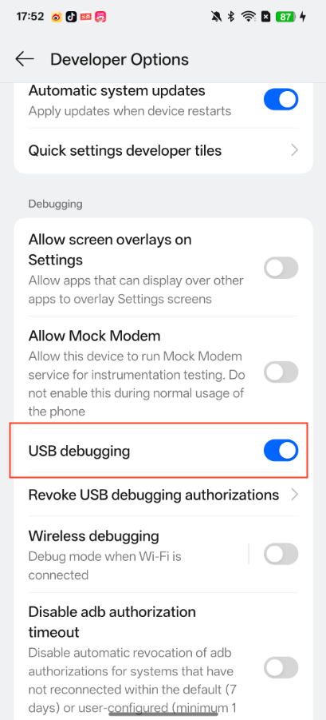
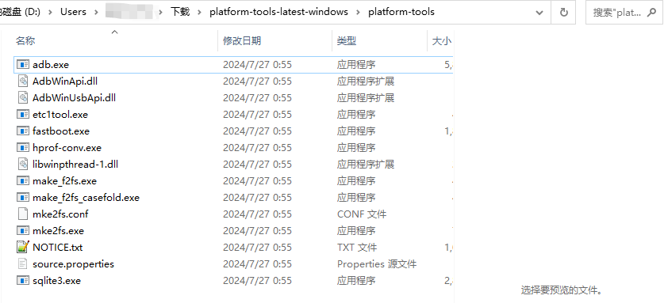
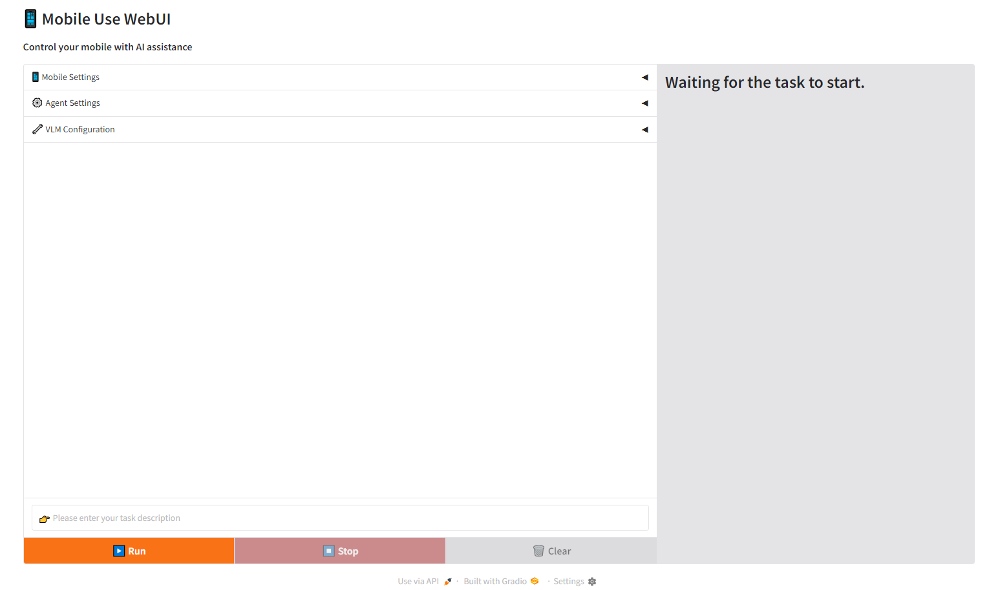
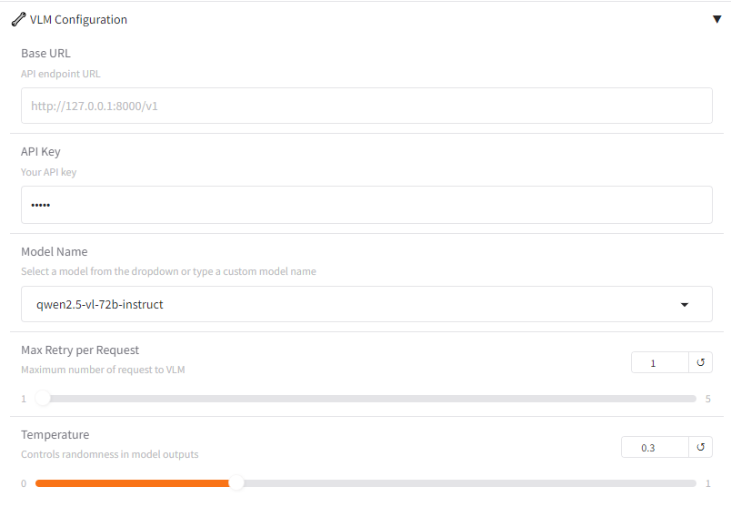
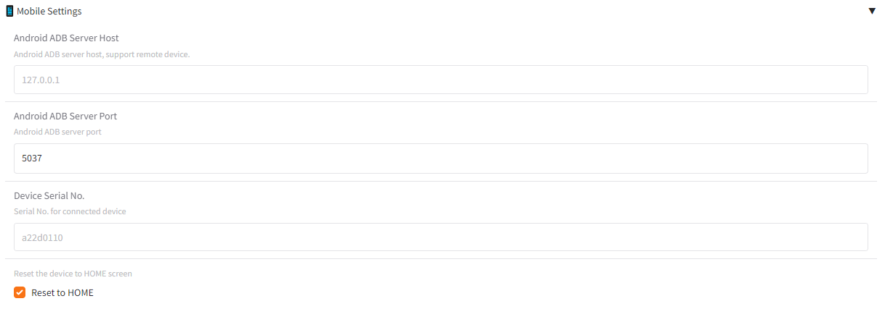
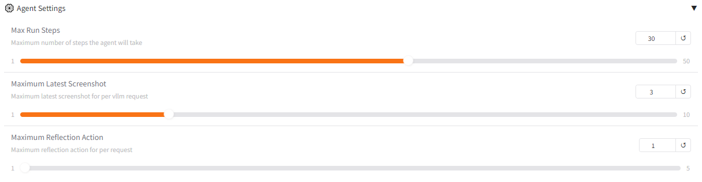

# Mobile Use 📱
[](https://opensource.org/licenses/MIT)


<h2 style="text-align: center;">Mobile Use​: Automate your mobile with AI - Any app, any task.</h2>




[ English | [中文](docs/README_zh.md) ]

https://github.com/user-attachments/assets/c82ae51e-f0a2-4c7b-86e8-e3411d9749bb

The user inputs the task description on the Web interface, and the Mobile Use automatically operates the mobile phone and completes the task.


## 📊 Benchmark


In the [AndroidWord](https://github.com/google-research/android_world) dynamic evaluation environment, we evaluated the Mobile Use agent solution with the visual large language model Qwen2.5-VL-72B and achieved a 38% success rate.

## ✨ Key Features
- **Auto-operating the phone**: Automatically operate the UI to complete tasks based on user input descriptions.
- **Smart Element Recognition**: Automatically parses GUI layouts and identifies operational targets.
- **Complex Task Processing**: Supports decomposition of complex task and multi-step operations.

## 🚀 Quick Start
### Prerequisites
#### 1. Python 3.10+

#### 2. Enable developer mode and open USB debugging on your phone


#### 3. Install SDK Platform-Tools
- Step 1. Download SDK Platform-Tools for Desktop, click [there](https://developer.android.com/tools/releases/platform-tools#downloads).
- Step 2. Unzip the downloaded file and add the platform-tools path to the environment variables.

- Step 3. Open the command line and enter `adb devices` (Windows: `adb.exe devices`) to verify adb is available or not.
- Step 4. Connect your computer and phone using a USB cable.


### Installation
> `mobile-use` requires [adb](https://developer.android.com/tools/adb) to control the phone, so relevant services and connections must be installed and configured in advance.

#### 1. Clone the repository
```
git clone https://github.com/MadeAgents/mobile-use
```

#### 2. Install dependencies
```
cd mobile-use
pip install .
```

#### 3. Verify the adb is connected
Run the `adb devices` (Windows: `adb.exe devices`) command on the command line terminal. If the device serial_no is listed, the connection is successful. The correct log is as follows:
```
List of devices attached
a22d0110        device
```

#### 4. Launch the webui service
```
python webui.py
```

### Usage
Once the service starts successfully, open the address http://127.0.0.1:7860 in your browser to access the WebUI page, as shown below:



Click VLM Configuration to set the Base URL and API Key of the multimodal large language model. It is recommended to use the multimodal large language model of Qwen2.5-VL series.



Input task descriptions in the input box at the lower left corner, click start to execute tasks.


## 🎉 More Demo
Case1：Search the latest news of DeepSeek-R2 in Xiaohongshu APP and forward one of the news to the Weibo App

https://github.com/user-attachments/assets/c44ddf8f-5d3f-4ace-abb3-fab4838b68a4


Case2：Order 2 Luckin coffees with Meituan, 1 hot raw coconut latte standard sweet, and 1 cold light jasmine

https://github.com/user-attachments/assets/6130e87e-dd07-4ddf-a64d-051760dbe6b3


Case3：用美团点一杯咖啡，冰的，标准糖

https://github.com/user-attachments/assets/fe4847ba-f94e-4baa-b4df-857cadae5b07


Case4：用美团帮我点2杯瑞幸咖啡，要生椰拿铁标准糖、热的

https://github.com/user-attachments/assets/5c4d3ce8-0135-4e6e-b003-b20f81f834d4


Case5：在浏览器找一张OPPO Find N5图片，询问DeepSeek应用该手机介绍信息，将找到的图片和介绍信息通过小红书发布

https://github.com/user-attachments/assets/4c3d8800-78b7-4323-aad2-8338fe81cb81


Case6：帮我去OPPO商城、京东、以及淘宝分别看一下oppofind n5售价是多少

https://github.com/user-attachments/assets/84990487-f2a3-4921-a20e-fcdebfc8fc60


## ⚙️ Advance

### Advance Settings
**📱 Mobile Settings**

The `Android ADB Server Host` and `Android ADB Server Port` allow you to specify the address and port of the android ADB service, which can be used for remote device connections or local android ADB services on non-default port. When multiple devices exist, you need to specify the `Device Serial No`. The `Reset to HOME` parameter indicates whether to return the phone to the home page before executing the task. If you continue the previous task, you need to cancel this option.



**⚙️ Agent Settings**

The `Max Run Steps` parameter specifies the maximum number of iteration steps for the Agent. If the current task exceeds the maximum number of iteration steps, the task will be stopped. Therefore, you are advised to set a larger value for complex tasks with more operation steps. The `Maximum Latest Screenshot` is to control the number of latest screenshots that the Agent can see. Because pictures consume more tokens, when the task has more steps, Appropriately take a Screenshot of the latest `Maximum Latest Screenshot` and send it to VLM to generate the next operation accordingly. The `Maximum Reflection Action` is to control the maximum number of reflection times of the Agent. The greater the value, the higher the fault tolerance rate of the Agent, but the longer the processing time of the task. 




**🔧 VLM Configuration**

Click `VLM Configuration` to specify the Base URL and API Key of the multimodal large language model, as well as the model name and temperature coefficient. It is recommended to use the multimodal large language model of Qwen2.5-VL series.


### Use agent with code
```python
import os
from dotenv import load_dotenv
from mobile_use.scheme import AgentState
from mobile_use import Environment, VLMWrapper, Agent
from mobile_use.logger import setup_logger

load_dotenv()
setup_logger(name='mobile_use')

# Create environment controller
env = Environment(serial_no='a22d0110')
vlm = VLMWrapper(
    model_name="qwen2.5-vl-72b-instruct", 
    api_key=os.getenv('VLM_API_KEY'),
    base_url=os.getenv('VLM_BASE_URL'),
    max_tokens=128,
    max_retry=1,
    temperature=0.0
)

agent = Agent.from_params(dict(type='default', env=env, vlm=vlm, max_steps=3))

going = True
input_content = goal
while going:
    going = False
    for step_data in agent.iter_run(input_content=input_content):
        print(step_data.action, step_data.thought)
```

### Create a Custom Agent

Define a custom Agent by inheriting the `Agent` and implementing the `step` and `iter_run` method

```python
from mobile_use.scheme import StepData
from mobile_use.utils import encode_image_url
from mobile_use.agents import Agent
from mobile_use.agents.agent import parse_reason_and_action

from typing import Iterator


SYSTEM_PROMPT = """
You are a GUI agent. You are given a task and your action history, with screenshots. You need to perform the next action to complete the task. 

## Output Format
```\nThought: ...
Action: ...\n```

## Action Space
click(point='(x1,y1)')
long_press(point='(x1,y1)')
type(text='')
scroll(start_point='(x1,y1)', end_point='(x3,y3)')
press_home()
press_back()
finished() # Submit the task regardless of whether it succeeds or fails.
call_user(question='') # Submit the task and call the user when the task is unsolvable, or when you need the user's help.
"""


@Agent.register('custom')
class CustomAgent(Agent):

    def reset(self, *args, **kwargs) -> None:
        """Reset Agent to init state"""
        self._init_data(**kwargs)

    def step(self, **kwargs) -> Iterator[StepData]:
        """Get the next step action based on the current environment state.

        Returns: The content is an iterator for StepData
        """
        # Init messages
        if self.curr_step_idx == 0:
            self.messages.extend([
                {'role': 'system', 'content': SYSTEM_PROMPT},
                {'role': 'user', 'content': f'Task goal description: {self.goal}'},
            ])

        # Get the current environment screen
        env_state = self.env.get_state()
        pixels = env_state.pixels.copy()
        pixels.thumbnail((1024, 1024))
 
        # Add new step data
        step_data = StepData(
            step_idx=self.curr_step_idx,
            curr_env_state=env_state,
            vlm_call_history=[]
        )
        self.trajectory.append(step_data)

        self.messages.append({
                'role': 'user', 
                'content': [
                    {'type': 'text', 'text': 'The mobile screenshot:'},
                    {"type": "image_url", "image_url": {"url": encode_image_url(pixels)}}
                ]
        })

        response = self.vlm.predict(self.messages, stream=False)
        step_data.content = response.choices[0].message.content
        reason, action = parse_reason_and_action(step_data.content, pixels.size, env_state.pixels.size)
        step_data.thought = reason
        step_data.action = action

        self.env.execute_action(action)

    def iter_run(self, input_content: str, stream: str=False) -> Iterator[StepData]:
        """Execute all step with maximum number of steps base on user input content.

        Returns: The content is an iterator for StepData
        """
        self.goal = input_content
        for step_idx in range(self.curr_step_idx, self.max_steps):
            self.curr_step_idx = step_idx
            for step_data in self.step(stream=stream):
                yield step_data
```

Use the custom agent
```python
agent = Agent.from_params(dict(type='custom', env=env, vlm=vlm, max_steps=3))
```


## 🌱Contributing
We welcome all forms of contributions! Please read our contribution guide to learn about:
- How to submit an issue to report problems.
- The process of participating in feature development.
- Code style and quality standards.
- Methods for suggesting documentation improvements.

## 📜 License
This project is licensed under the MIT License, which permits free use and modification of the code but requires retaining the original copyright notice.

## 📚 Citation
If you have used this project in your research or work, please cite:
```
@software{
  title = {Mobile Use: A GUI agent system for operating smartphones through natural language commands.},
  author = {Jiamu Zhou, Ning Li, Qiuying Peng, Xiaoyun Mo, Qiqiang Lin, Jun Wang, Yin Zhao},
  year = {2025},
  publisher = {GitHub},
  url = {https://github.com/MadeAgents/mobile-use}
}
```

## 🤝 Acknowledgements
This repo benefits from [Gradio](https://www.gradio.app) and [Qwen2.5-VL](https://huggingface.co/collections/Qwen/qwen25-vl-6795ffac22b334a837c0f9a5).Thanks for their wonderful works.
