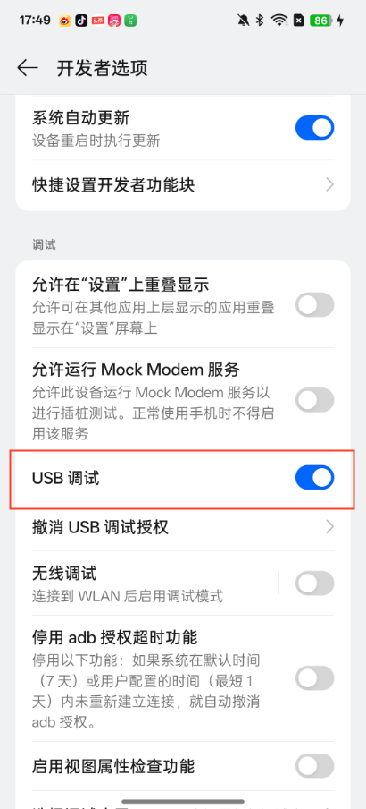

# Mobile Use 📱
[](https://opensource.org/licenses/MIT)

<h2 style="text-align: center;">Mobile Use​: Automate your mobile with AI - Any app, any task.</h2>


[ 中文 | [English](../README.md) ]

https://github.com/user-attachments/assets/7cd023b6-816f-4514-93cc-62bcb1d888c5

用户在 Web 界面输入自然人语言指令，Mobile Use 的 GUI 智能体自动操作手机并完成任务。


## 📊 Benchmark


我们在 [AndroidWord](https://github.com/google-research/android_world) 动态测评环境中评估了 Mobile Use 的智能体方案（视觉模型使用 Qwen2.5-VL-72B），获得 38% 的成功率。

## ✨ 核心特性
- **自动操作手机**：基于用户的输入任务描述，自动操作UI完成任务
- **智能元素识别**：解析GUI布局并定位操作目标
- **复杂任务处理**：支持复杂指令分解和多步操作


<!-- ## 🛠️ 技术架构 -->


## 🚀 快速开始
### 前置要求
#### 1. Python 3.10+

#### 2. 启用开发者模式并打开手机上的USB调试


#### 3. 安装 SDK Platform-Tools 工具
- Step 1. 下载 SDK Platform-Tools 工具, 点击 [这里](https://developer.android.com/tools/releases/platform-tools#downloads).
- Step 2. 解压文件并将 `platform-tools` 路径添加至环境变量.

- Step 3. 打开命令行，输入 `adb devices` (Windows: `adb.exe devices`) 验证 adb 是否可用
- Step 4. 通过USB线连接电脑和手机


### 安装指南
> `mobile-use` 需要使用 [adb](https://developer.android.com/tools/adb) 来控制手机，需要预先安装相关工具并使用USB连接手机和电脑。

#### 1. 克隆项目
```
git clone https://github.com/MadeAgents/mobile-use
```

#### 2. 安装依赖
```
pip install .
```

#### 3. 验证 adb 是否已连接
在命令行终端执行 `adb devices` （Windows：`adb.exe devices`）命令，如果列出设备号表示已连接成功，正确的日志如下：
```
List of devices attached
a22d0110        device
```

#### 4. 启动服务
```
python webui.py
```

### 使用方式
待服务启动成功之后，在浏览器打开地址：http://127.0.0.1:7860，即可进入到 WebUI 页面，如下图所示：


点击 VLM Configuration 设置多模态大语言模型 Base URL 和 API Key，推荐使用 Qwen2.5-VL 系列的多模态大语言模型。


在左下方的输入框输入任务描述，点击开始即可执行任务。


## 🎉 More Demo
Case1：Search the latest news of DeepSeek-R2 in Xiaohongshu APP and forward one of the news to the Weibo App

https://github.com/user-attachments/assets/c44ddf8f-5d3f-4ace-abb3-fab4838b68a4


Case2：Order 2 Luckin coffees with Meituan, 1 hot raw coconut latte standard sweet, and 1 cold light jasmine

https://github.com/user-attachments/assets/6130e87e-dd07-4ddf-a64d-051760dbe6b3


Case3：用美团点一杯咖啡，冰的，标准糖

https://github.com/user-attachments/assets/fe4847ba-f94e-4baa-b4df-857cadae5b07


Case4：用美团帮我点2杯瑞幸咖啡，要生椰拿铁标准糖、热的

https://github.com/user-attachments/assets/5c4d3ce8-0135-4e6e-b003-b20f81f834d4


Case5：在浏览器找一张OPPO Find N5图片，询问DeepSeek应用该手机介绍信息，将找到的图片和介绍信息通过小红书发布

https://github.com/user-attachments/assets/4c3d8800-78b7-4323-aad2-8338fe81cb81


Case6：帮我去OPPO商城、京东、以及淘宝分别看一下oppofind n5售价是多少

https://github.com/user-attachments/assets/84990487-f2a3-4921-a20e-fcdebfc8fc60


## ⚙️ 高级用法

### 更多参数配置
**📱 Mobile Settings**
通过 `Android ADB Server Host` 和 `Android ADB Server Port` 可以指定 Android ADB 服务的地址和端口，可用于远程设备连接或者本地非默认端口的 Android ADB 服务。当存在多台设备时，需要通过 `Device Serial No.` 指定使用那一台设备。`Reset to HOME` 参数表示执行任务时是否将手机返回到主页再执行，如果时继续上一个任务，则需要取消该选项。


**⚙️ Agent Settings**

`Max Run Steps` 参数是指定 Agent 最大迭代步数，当前任务超出最大迭代步数时，任务将被停止。因此，对于较操作步数较多的复杂任务，建议设置较大值。`Maximum Latest Screenshot` 是控制 Agent 能否看到的最新屏幕截图数量，由于图片消耗较多Token，因此当任务步数较多时，适当取最新的 `Maximum Latest Screenshot` 张截图发给 VLM 生成下一步操作相应。`Maximum Reflection Action` 则是控制 Agent 反思的最大次数，其值越大，Agent 的容错率就越高，但同时处理任务的耗时也随之越长。通过点击 **⚙️ Agent Settings** 选项可以设置这三个参数的值：


**🔧 VLM Configuration**
点击 `VLM Configuration` 可指定多模态大语言模型的 Base URL 和 API Key，以及模型名称和温度系数，推荐使用 Qwen2.5-VL 系列的多模态大语言模型。


### 在 Python 脚本中使用 Agent 智能体
```python
import os
from dotenv import load_dotenv
from mobile_use.scheme import AgentState
from mobile_use import Environment, VLMWrapper, Agent
from mobile_use.logger import setup_logger

load_dotenv()
setup_logger(name='mobile_use')

# Create environment controller
env = Environment(serial_no='a22d0110')
vlm = VLMWrapper(
    model_name="qwen2.5-vl-72b-instruct", 
    api_key=os.getenv('VLM_API_KEY'),
    base_url=os.getenv('VLM_BASE_URL'),
    max_tokens=128,
    max_retry=1,
    temperature=0.0
)

agent = Agent.from_params(dict(type='default', env=env, vlm=vlm, max_steps=3))

going = True
input_content = goal
while going:
    going = False
    for step_data in agent.iter_run(input_content=input_content):
        print(step_data.action, step_data.thought)
```

### 创建定制化 Agent

通过继承 `Agent` 并实现 `step` 和 `iter_run` 方法来定义自定义 Agent。

```python
from mobile_use.scheme import StepData
from mobile_use.utils import encode_image_url
from mobile_use.agents import Agent
from mobile_use.agents.agent import parse_reason_and_action

from typing import Iterator


SYSTEM_PROMPT = """
You are a GUI agent. You are given a task and your action history, with screenshots. You need to perform the next action to complete the task. 

## Output Format
```\nThought: ...
Action: ...\n```

## Action Space
click(point='(x1,y1)')
long_press(point='(x1,y1)')
type(text='')
scroll(start_point='(x1,y1)', end_point='(x3,y3)')
press_home()
press_back()
finished() # Submit the task regardless of whether it succeeds or fails.
call_user(question='') # Submit the task and call the user when the task is unsolvable, or when you need the user's help.
"""


@Agent.register('custom')
class CustomAgent(Agent):

    def reset(self, *args, **kwargs) -> None:
        """Reset Agent to init state"""
        self._init_data(**kwargs)

    def step(self, **kwargs) -> Iterator[StepData]:
        """Get the next step action based on the current environment state.

        Returns: The content is an iterator for StepData
        """
        # Init messages
        if self.curr_step_idx == 0:
            self.messages.extend([
                {'role': 'system', 'content': SYSTEM_PROMPT},
                {'role': 'user', 'content': f'Task goal description: {self.goal}'},
            ])

        # Get the current environment screen
        env_state = self.env.get_state()
        pixels = env_state.pixels.copy()
        pixels.thumbnail((1024, 1024))
 
        # Add new step data
        step_data = StepData(
            step_idx=self.curr_step_idx,
            curr_env_state=env_state,
            vlm_call_history=[]
        )
        self.trajectory.append(step_data)

        self.messages.append({
                'role': 'user', 
                'content': [
                    {'type': 'text', 'text': 'The mobile screenshot:'},
                    {"type": "image_url", "image_url": {"url": encode_image_url(pixels)}}
                ]
        })

        response = self.vlm.predict(self.messages, stream=False)
        step_data.content = response.choices[0].message.content
        reason, action = parse_reason_and_action(step_data.content, pixels.size, env_state.pixels.size)
        step_data.thought = reason
        step_data.action = action

        self.env.execute_action(action)

    def iter_run(self, input_content: str, stream: str=False) -> Iterator[StepData]:
        """Execute all step with maximum number of steps base on user input content.

        Returns: The content is an iterator for StepData
        """
        self.goal = input_content
        for step_idx in range(self.curr_step_idx, self.max_steps):
            self.curr_step_idx = step_idx
            for step_data in self.step(stream=stream):
                yield step_data
```

实例化定制 Agent
```python
agent = Agent.from_params(dict(type='custom', env=env, vlm=vlm, max_steps=3))
```


## 🌱 参与贡献
我们欢迎各种形式的贡献！请阅读贡献指南了解：
- 如何提交issue报告问题
- 参与功能开发的流程
- 代码风格和质量标准
- 文档改进建议方式


## 📜 许可协议
本项目采用 MIT 许可证，允许自由使用和修改代码，但需保留原始版权声明。


## 📚 引用
如果您在您的研究或工作中使用了本项目，请引用：
```
@software{
  title = {Mobile Use​: Automate your mobile with AI - Any app, any task.},
  author = {Jiamu Zhou, Xiaoyun Mo, Ning Li, Qiuying Peng},
  year = {2025},
  publisher = {GitHub},
  url = {https://github.com/MadeAgents/mobile-use}
}
```

## 🤝 致谢
本项目得益于：
- 灵感来自 [browser-use](https://github.com/browser-use/browser-use)
- 智能体的大模型是基于 [Qwen2.5-VL](https://huggingface.co/collections/Qwen/qwen25-vl-6795ffac22b334a837c0f9a5)
- Web UI 是基于 [Gradio](https://www.gradio.app)

感谢他们的精彩工作。
