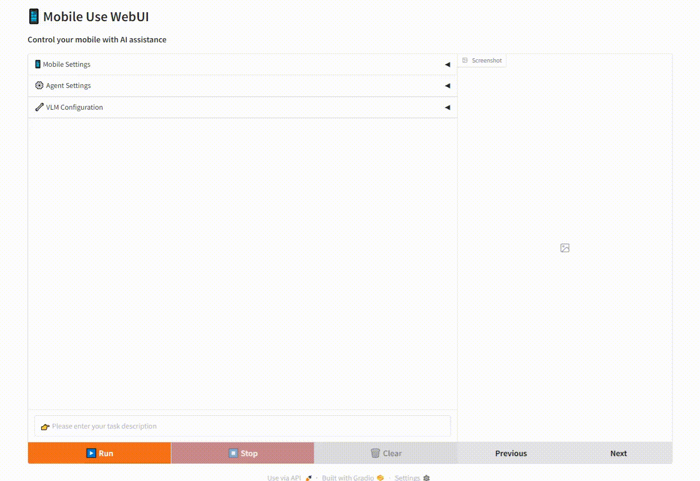

# Mobile Use 🚀
[](https://opensource.org/licenses/MIT)


> 用自然语言指挥手机操作的智能GUI代理系统

**Mobile Use** 是一个突破性的开源项目，通过自然语言指令实现智能手机的自动化操作。结合视觉大语言模型（VLM）的语义与视觉理解能力和 Android 调试桥（ADB）的系统级控制，让您可以用人类语言直接与手机交互。

[ 中文 | [English](README.md) ]




## ✨ 核心特性
- **自然语言交互**：自然语言指令控制手机
- **智能元素识别**：自动解析GUI布局并定位操作目标
- **多任务编排**：支持复杂指令分解和多步操作


<!-- ## 🛠️ 技术架构 -->


## 🚀 快速开始
### 前置要求
- Python 3.10+
- Android 手机开启开发者模式
- [ADB环境配置](https://developer.android.com/tools/adb)


### 安装指南
> `mobile-use` 需要使用 [adb](https://developer.android.com/tools/adb) 来控制手机，需要预先安装并配置好相关服务和连接。

#### 1. 克隆项目
```
git clone https://github.com/MadeAgents/mobile-use
```

#### 2. 安装依赖
```
pip install .
```

#### 3. 验证 adb 是否已连接
在命令行终端执行 `adb devices` （Windows：`adb.exe devices`）命令，如果列出设备号表示已连接成功，正确的日志如下：
```
List of devices attached
a22d0110        device
```

#### 4. 启动服务
```
python webui.py
```

### 使用方式
待服务启动成功之后，在浏览器打开地址：http://127.0.0.1:7860，即可进入到 WebUI 页面，如下图所示：


点击 VLM Configuration 设置多模态大语言模型 Base URL 和 API Key，推荐使用 Qwen2.5-VL 系列的多模态大语言模型。


在左下方的输入框输入任务描述，点击开始即可执行任务。


## 🎉 More Demo
Case1：Search the latest news of DeepSeek-R2 in Xiaohongshu APP and forward one of the news to the Weibo App


Case2：Order 2 Luckin coffees with Meituan, 1 hot raw coconut latte standard sweet, and 1 cold light jasmine


Case3：用美团点一杯咖啡，冰的，标准糖


Case4：用美团帮我点2杯瑞幸咖啡，要生椰拿铁标准糖、热的


Case5：在浏览器找一张OPPO Find N5图片，询问DeepSeek应用该手机介绍信息，将找到的图片和介绍信息通过小红书发布


Case6：帮我去OPPO商城、京东、以及淘宝分别看一下oppofind n5售价是多少


## 🌱 参与贡献
我们欢迎各种形式的贡献！请阅读贡献指南了解：
- 如何提交issue报告问题
- 参与功能开发的流程
- 代码风格和质量标准
- 文档改进建议方式


## 📜 许可协议
本项目采用 MIT 许可证，允许自由使用和修改代码，但需保留原始版权声明。


## 📚 引用
如果您在您的研究或工作中使用了本项目，请引用：
```
@software{
  title = {Mobile Use: A GUI agent system for operating smartphones through natural language commands.},
  author = {Jiamu Zhou, Ning Li, Qiuying Peng, Xiaoyun Mo, Qiqiang Lin, Jun Wang, Yin Zhao},
  year = {2025},
  publisher = {GitHub},
  url = {https://github.com/MadeAgents/mobile-use}
}
```

## 🤝 致谢
本项目得益于 [Gradio](https://www.gradio.app) 和 [Qwen2.5-VL](https://huggingface.co/collections/Qwen/qwen25-vl-6795ffac22b334a837c0f9a5)，感谢他们的精彩工作。
